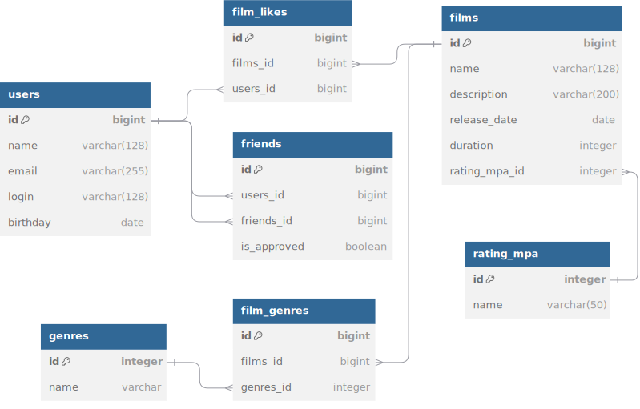

# java-filmorate
Filmorate project repository.

### схема базы данных:



* films - таблица для хранения информации о фильмах
* users - таблица для хранения данных о пользователях
* films_likes - таблица для хранения данных о фильмах понравившихся пользователям
* friends - таблица для хранения друзей пользователя, с учетом флага о подверждении дружбы (поле is_approved)
* genre - таблица жанров
* film_genres - таблица жанров фильма
* rating_mpa - таблица рейтингов фильмов

#### запросы:

* top 10 популярных фильмов
```SQL
with cte as (
select film_id
, count(user_id) cnt
from film_likes
group by film_id
order by cnt desc
limit 10
)
select f.name
, cte.cnt
from film f
join cte on f.id = cte.film_id
;
```